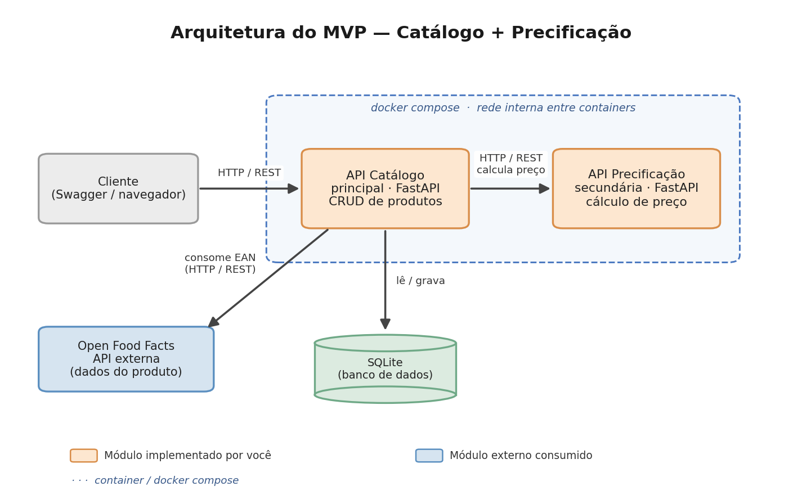

# API Catálogo

API REST desenvolvida em Python com FastAPI. É o **serviço principal** de um MVP de componentização: gerencia um catálogo de produtos (CRUD com persistência em SQLite), **importa dados de produtos do Open Food Facts** pelo código de barras (EAN) e **calcula o preço de venda** consumindo a [API de Precificação](https://github.com/edisonhc1998-spec/precificacao-api).

## Arquitetura



O sistema é composto por três componentes que se comunicam via REST:

- **API Catálogo** (este repositório) — serviço principal, dono do banco de dados.
- **API Precificação** — serviço secundário que calcula o preço de venda.
- **Open Food Facts** — API externa pública, consumida para obter os dados dos produtos.

## Tecnologias

- Python 3.11
- FastAPI
- Uvicorn
- SQLite
- Docker / Docker Compose

## Funcionalidades

- CRUD completo de produtos (GET, POST, PUT, DELETE)
- Importação de produtos pelo código de barras (EAN) via Open Food Facts
- Cálculo do preço de venda consumindo a API de Precificação
- Filtro, ordenação e paginação na listagem de produtos
- Autenticação por chave de API (header `X-API-Key`) nas rotas de escrita

## Rotas

| Método | Rota | Descrição | Autenticação |
|--------|------|-----------|:---:|
| GET | `/health` | Verifica se a API está no ar | — |
| GET | `/produtos` | Lista produtos (filtro, ordenação, paginação) | — |
| GET | `/produtos/{id}` | Consulta um produto | — |
| POST | `/produtos` | Cadastra um produto | sim |
| PUT | `/produtos/{id}` | Atualiza um produto | sim |
| DELETE | `/produtos/{id}` | Remove um produto | sim |
| POST | `/produtos/importar/{ean}` | Importa um produto do Open Food Facts | sim |
| GET | `/produtos/{id}/preco` | Calcula o preço de venda (consome a API de Precificação) | — |

As rotas marcadas exigem o header `X-API-Key`. A chave padrão é `minha-chave-secreta-123` (configurável pela variável de ambiente `API_KEY`).

## API externa consumida — Open Food Facts

- **Serviço:** [Open Food Facts](https://world.openfoodfacts.org)
- **Custo:** gratuito, sem necessidade de cadastro ou chave de API (apenas um User-Agent identificando a aplicação).
- **Licença dos dados:** Open Database License (ODbL).
- **Rota utilizada:** `GET https://world.openfoodfacts.org/api/v0/product/{ean}.json`
- **Uso:** ao importar um produto, a aplicação consulta o Open Food Facts pelo EAN, **extrai e trata** os dados (nome, marca e categoria) e os grava no banco de dados local. Os dados são consumidos e processados dentro da própria aplicação, sem redirecionamento para o serviço externo.

## Como executar

### Opção 1 — Sistema completo com Docker Compose (recomendado)

O `docker-compose.yml` sobe as duas APIs juntas, já conectadas em rede. Para isso, **clone os dois repositórios na mesma pasta**:

```
pasta/
├── catalogo-api/       (este repositório)
└── precificacao-api/   (github.com/edisonhc1998-spec/precificacao-api)
```

Depois, de dentro da pasta `catalogo-api`, execute:

```bash
docker compose up --build
```

- API Catálogo: http://localhost:8000/docs
- API Precificação: http://localhost:8001/docs

### Opção 2 — Local (Python)

> Observação: a API de Precificação precisa estar em execução na porta 8001 para o cálculo de preço funcionar.

```bash
python -m venv venv
venv\Scripts\activate
pip install -r requirements.txt
uvicorn main:app --reload --port 8000
```

## Documentação interativa (Swagger)

Com a API em execução, acesse a documentação gerada automaticamente pelo FastAPI:

```
http://localhost:8000/docs
```

## Autor

Edison Huarancca Chunga
